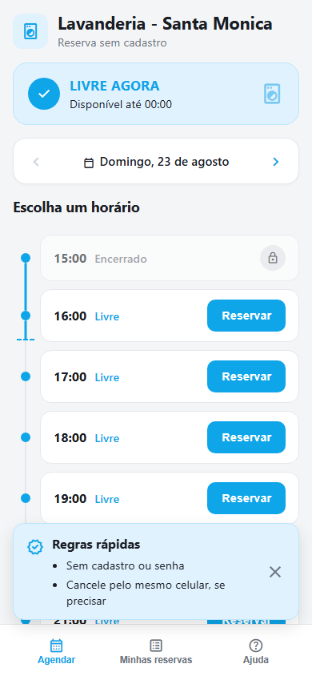
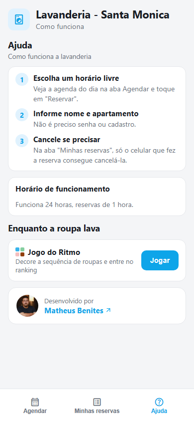

# Lavanderia - Santa Monica

App mobile-first pra reservar horário na lavanderia do condomínio, sem cadastro e sem senha. Acesso via QR code — cada celular reconhece suas próprias reservas por um token salvo localmente.

| Agendar | Ajuda |
|---|---|
|  |  |

## Stack

React 19 + TypeScript + Vite · Supabase (Postgres + RLS + Realtime, escrita só via funções `SECURITY DEFINER`) · Cloudflare Workers · CI com Gitleaks, Trivy, Checkov, SonarQube e OWASP ZAP.

## Rodando

```bash
npm install
npm run dev      # servidor local
npm run test     # testes unitários
npm run lint     # oxlint
npm run build    # typecheck + build de produção
```

Precisa de um `.env` com `VITE_SUPABASE_URL` e `VITE_SUPABASE_ANON_KEY` (veja `.env.example`).

## Docker / Terraform

```bash
docker compose -f IAC/docker-compose.yml --env-file .env up --build
```

```bash
cd IAC/terraform
cp terraform.tfvars.example terraform.tfvars
terraform init && terraform plan && terraform apply
```

As chaves do Supabase são injetadas em runtime (não ficam na imagem). Detalhes das variáveis em `IAC/terraform/variables.tf`.

## Branches

`master` roda o pipeline completo (CI + deploy) e publica a imagem verificada no GHCR. `feature` e `test-devops` são de desenvolvimento, sem pipeline.
